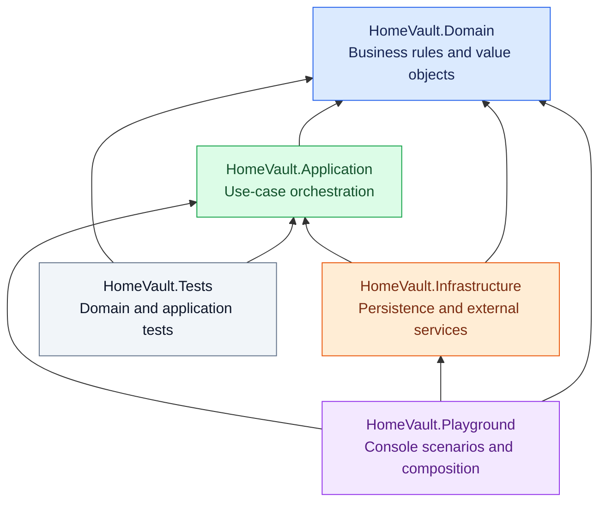
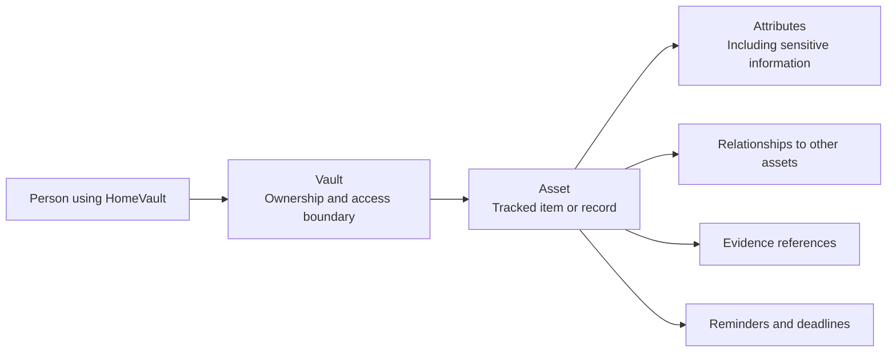

# Architecture

Status: stack and project boundaries accepted on 2026-09-25; see [ADR-0001](ADRs/0001-initial-stack.md) and [ADR-0002](ADRs/0002-domain-first-boundaries.md). NUnit is confirmed, as is the selective dependency injection direction in [ADR-0003](ADRs/0003-selective-dependency-injection.md).

Keep business rules in a small domain model. Application coordinates use cases. Infrastructure supplies persistence and external services. The Playground exercises behavior before a UI exists. Do not add interfaces or abstractions without a concrete use.

## Project dependencies

Arrows mean a compile-time project reference, not runtime data flow.

Domain has no project dependencies or framework-specific business logic. .NET base libraries are allowed. Tests initially reference Domain and Application only. Revisit infrastructure testing when persistence is introduced.

## Dependency injection

Use constructor injection where explicit collaborators improve clarity or testing. Application owns contracts for the technical capabilities its use cases need; Infrastructure implements them. Add interfaces only for a concrete boundary or substitution need.

Playground is the initial composition root and manually wires implementations while that remains simple. No DI container or package is selected. Domain remains independent of DI frameworks, containers, registration APIs, and framework attributes; any justified domain collaboration uses ordinary C#. Entities and value objects use domain constructors or factories. Do not use a service locator in Domain or Application. See [ADR-0003](ADRs/0003-selective-dependency-injection.md) for rationale and tradeoffs.

## Conceptual domain map

This illustrates vocabulary, not finalized database tables or aggregate boundaries.

Do not infer that Vault loads or owns every Asset as an in-memory aggregate child. Cross-aggregate references and consistency rules require discussion during the relevant phase.

## Deferred decisions

Database engine, ORM adoption, hosting, UI framework, authentication provider, encryption/key management, and event dispatch are undecided. The prior EF Core + SQL Server roadmap is context, not acceptance for this restart.
