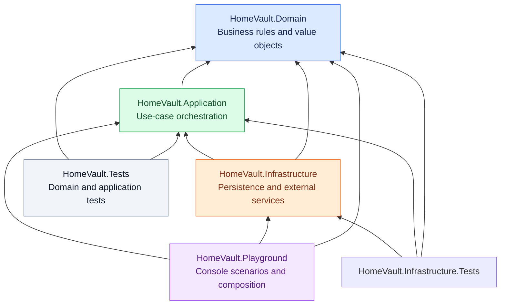
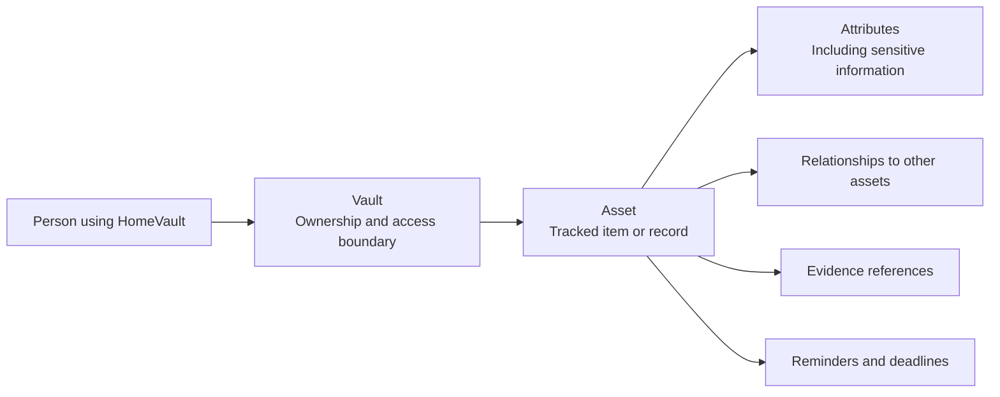

# Architecture

Status: stack and project boundaries accepted on 2026-09-25; see [ADR-0001](ADRs/0001-initial-stack.md) and [ADR-0002](ADRs/0002-domain-first-boundaries.md). NUnit is confirmed, as is the selective dependency injection direction in [ADR-0003](ADRs/0003-selective-dependency-injection.md).

Keep business rules in a small domain model. Application coordinates use cases. Infrastructure supplies persistence and external services. The Playground exercises behavior before a UI exists. Do not add interfaces or abstractions without a concrete use.

## Project dependencies

The independent [Angular UI](hv-23-angular-ui.md) calls the authenticated API over
HTTP. It imports no C# assemblies, persistence models or database schemas. A local
same-origin HTTPS proxy preserves cookie/antiforgery behavior. Domain rules and
current-access checks remain in the existing server layers; route guards only
control navigation. Angular builds independently under `frontend/homevault`.

[Encryption envelopes](hv-21-encryption-envelopes.md) are internal Infrastructure
components under ADR-0027. They implement framing, authenticated record binding,
owned read-key leases and bounded write sessions. No production custody provider,
host registration, schema change or Sensitive operation is introduced by #63.

#64 adds an internal Windows DPAPI CurrentUser custody adapter and explicit
[key recovery commands](hv-21-key-recovery.md) under accepted ADR-0028. Immutable
protected generations and authenticated portable exports are verified before
issuing a fresh write session. [Sensitive attribute integration](hv-21-sensitive-attributes.md)
under ADR-0029 adds an Application-owned atomic store, a separate ciphertext-only
table, and explicit Owner/Administrator text operations. Metadata listing never
loads ciphertext. The optional encrypted host owns the bounded write session;
the normal host keeps Sensitive endpoints unmapped.

#66 adds [offline maintenance](hv-21-rotation-recovery.md) under ADR-0030.
Infrastructure coordinates bounded re-encryption, authenticated recovery sets,
new-destination restoration and existing account invalidation. The API executable
provides terminal commands; no maintenance HTTP endpoint or automatic activation
is introduced. Domain and Application remain independent of key/storage formats.

[Reminder lifecycle operations](hv-22-reminders.md) use Application-owned
IReminderStore with current-access and actual Asset ownership checks inside SQLite
transactions. Domain restoration validates stored state; UTC ticks preserve exact
instants. The authenticated API separates metadata from deliberate plaintext action
reads under accepted ADR-0026. No scheduling or notification service is introduced.

Arrows mean a compile-time project reference, not runtime data flow.

```mermaid
flowchart BT
    Application[HomeVault.Application<br/>Use-case orchestration] --> Domain[HomeVault.Domain<br/>Business rules and value objects]
    Infrastructure[HomeVault.Infrastructure<br/>Persistence and external services] --> Application
    Infrastructure --> Domain
    Playground[HomeVault.Playground<br/>Console scenarios and composition] --> Application
    Playground --> Infrastructure
    Playground --> Domain
    Tests[HomeVault.Tests<br/>Domain and application tests] --> Domain
    Tests --> Application
    InfrastructureTests[HomeVault.Infrastructure.Tests] --> Infrastructure
    InfrastructureTests --> Application
    InfrastructureTests --> Domain
    style Domain fill:#dbeafe,stroke:#2563eb,color:#172554
    style Application fill:#dcfce7,stroke:#16a34a,color:#14532d
    style Infrastructure fill:#ffedd5,stroke:#ea580c,color:#7c2d12
    style Playground fill:#f3e8ff,stroke:#9333ea,color:#581c87
    style Tests fill:#f1f5f9,stroke:#64748b,color:#0f172a
```

Domain has no project dependencies or framework-specific business logic. .NET base libraries and Ardalis.GuardClauses are allowed under [ADR-0005](ADRs/0005-guard-clauses.md); other Domain package dependencies remain prohibited. HomeVault.Tests still references Domain and Application only. The separate HomeVault.Infrastructure.Tests project references Infrastructure, Application, and Domain under [ADR-0014](ADRs/0014-in-memory-vault-infrastructure.md). Its internal snapshot inspection verifies storage without introducing a public read API.

## Dependency injection

Use constructor injection where explicit collaborators improve clarity or testing. Application owns contracts for the technical capabilities its use cases need; Infrastructure implements them. Add interfaces only for a concrete boundary or substitution need.

Playground manually wires implementations while that remains simple. The accepted
Identity/API composition uses Microsoft's built-in host services under ADR-0020;
no third-party container is selected. Domain remains independent of DI frameworks,
containers, registration APIs and framework attributes; justified domain
collaboration uses ordinary C#. Construct entities/value objects through their
constructors or factories. Do not use a service locator in Domain or Application.
See [ADR-0003](ADRs/0003-selective-dependency-injection.md).

## Conceptual domain map

This illustrates vocabulary, not finalized database tables or aggregate boundaries.

```mermaid
flowchart LR
    User[Person using HomeVault] --> Vault[Vault<br/>Ownership and access boundary]
    Vault --> Asset[Asset<br/>Tracked item or record]
    Asset --> Attribute[Attributes<br/>Including sensitive information]
    Asset --> Relationship[Relationships to other assets]
    Asset --> Evidence[Evidence references]
    Asset --> Reminder[Reminders and deadlines]
```

Do not infer that Vault loads or owns every Asset as an in-memory aggregate child. Cross-aggregate references and consistency rules require discussion during the relevant phase.

## Deferred decisions

Under [ADR-0015](ADRs/0015-vault-bound-asset-registration.md), Playground shares
one InMemoryHomeVaultStore between the Vault repository and Asset registration
adapter. Application owns the purpose-specific atomic registration contract;
Infrastructure checks current membership, role, and lifecycle together with
insertion under one lock. No public read/update API or authentication provider
is implied. Future stored Vault mutations must serialize through this boundary.

SQLite with EF Core is accepted for the local-first version under [ADR-0017](ADRs/0017-durable-local-persistence.md). Hosting, UI, authentication provider, event dispatch, and a future server database remain undecided.

[ADR-0018](ADRs/0018-sensitive-value-encryption.md) accepts Sensitive attribute
encryption, Windows key custody, and portable backup recovery with a separately
stored recovery key. The design was accepted on 2026-10-01; implementation remains
in the linked follow-up tasks.

Under [ADR-0020](ADRs/0020-local-accounts-vault-authorization.md), Infrastructure
owns ASP.NET Core Identity storage and Windows-protected session keys. Domain and
Application remain independent of Identity and web frameworks. The first storage
slice is extended by HomeVault.Api under [ADR-0021](ADRs/0021-operator-invitations-recovery.md):
the API composition root references Infrastructure and owns HTTP cookie authentication,
antiforgery and local operator commands. Infrastructure owns Identity operations and
credential storage. HomeVault.Api.Tests references the API and uses framework TestHost
with real SQLite, separate from the Domain/Application-only tests. Microsoft DI stays
at the host/Infrastructure boundary; no web dependencies enter Domain/Application.
See [HV-22.2](hv-22-accounts.md). Under [HV-22.3](hv-22-authorized-api.md), the API
also references Application explicitly, supplies request-scoped ICurrentActor from
validated cookie identity, and calls the three existing use cases through SQLite
adapters. Versioned transport DTOs and the embedded OpenAPI contract belong to the
API boundary. No Domain/Application dependency or persistence schema changes.

## Accepted domain boundaries

[Relationship operations](hv-22-relationships.md) use an Application-owned
IRelationshipStore for atomic creation/removal and consistent inspection. The
SQLite adapter verifies both actual Asset VaultIds; membership in multiple Vaults
does not permit cross-Vault links. Domain restoration preserves retained lifecycle
state. Separate EF mapping and a filtered unique index enforce one active directed
tuple under ADR-0025; removing a Relationship never deletes either Asset.

[Evidence operations](hv-22-evidence.md) use an Application-owned IEvidenceStore
for Asset-local add/remove, metadata inspection and deliberate content reads.
SQLite serializes writes with current membership/archive checks and restores only
the needed Evidence state before Domain mutations. Separate EF configuration maps
AssetEvidence under ADR-0024. Metadata queries never load content; content is
plaintext, and no URL fetching, document resolution or encryption is implied.

[Ordinary attribute operations](hv-22-ordinary-attributes.md) use an
Application-owned IOrdinaryAttributeStore. SQLite checks access and classification
before validated Domain restoration, serializes writes with membership/archive
changes and persists only the affected row. Separate EF configuration maps the
ordinary-only AssetAttributes table under accepted ADR-0023. Sensitive storage
remains blocked on the encryption implementation.

[Vault membership operations](hv-22-vault-membership.md) use an Application-owned
IVaultMembershipStore for atomic current-role checks, real-account addition and
Domain mutation through validated restoration. SQLite serializes membership,
archival and Asset writes; the existing schema and project dependencies remain.

Under accepted [ADR-0022](ADRs/0022-remaining-authorized-operations.md),
[ArchiveVault](hv-22-vault-archive.md) restores validated Vault/membership state
and invokes Domain archival inside the same SQLite write transaction as current
Owner checks. Application owns IVaultArchiveStore; HTTP exposes no raw storage
or restoration API. Existing schema and Asset read access remain unchanged.

[ADR-0004](ADRs/0004-domain-language-and-boundaries.md) records separate Vault,
Asset, Relationship, and Reminder roots, with attributes and Evidence metadata
owned by Asset. It details cross-aggregate ownership and archive consistency,
including concurrent changes. The owner accepted this decision on 2026-09-28. It does not change the accepted project dependencies above.
